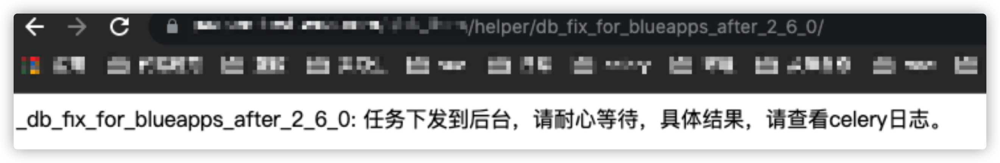
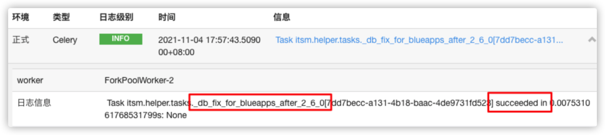

# ITSM V2.6.0 -> V2.6.1升级指南

### 背景：

V2.6.1版本将代码目录中的blueapps抽离出来并进行了升级，较V2.6.0版本，对其migrations进行了兼容

请在部署V2.6.1之前，按照本教程步骤进行升级前的兼容处理，否则可能会遇到部署失败的情况

### 步骤：

1. 部署V2.6.0的最新安装包
2. 访问 `{ITSM_URL}/helper/db_fix_for_blueapps_after_2_6_0/`，使用 admin 登录，执行兼容操作，具体操作会在后台任务中实现，具体结果请在celery日志中查看

3. 查看日志中的任务执行结果

4. 如此，任务执行成功
5. 在开发者中心部署V2.6.1的安装包，即可部署成功
