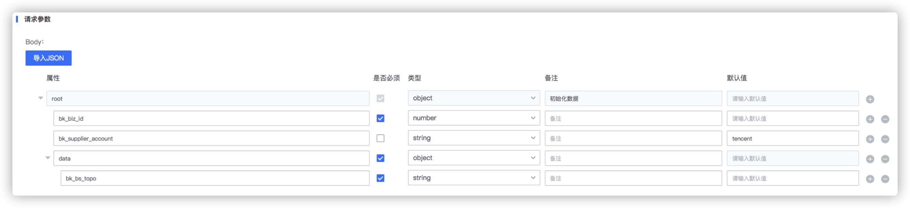

# API请求沙箱使用说明

#### 请求前的数据加工：

以CC修改业务为例：配置的 `body` 请求参数如下：

由于 `bk_bs_topo` 为一个动态数组，无法配置，因此在传入的时候可以使用 `json.dumps` 转为文本传入，在请求之前，需要对该参数做json解析。示例如下：

```python
query_params["data"].update({"bk_bs_topo": json.loads(query_params["data"]["bk_bs_topo"])})
```
其中 `query_params` 为GET请求参数中的 `query`， POST请求参数中的 `body`，是沙箱的输入函数，沙箱的返回也是 `query_params`

考虑到安全问题，沙箱可支持的使用函数有限，如下

```
'_getitem_': default_guarded_getitem,
'_getiter_': default_guarded_getiter,
'_iter_unpack_sequence_': guarded_iter_unpack_sequence,
'enumerate': enumerate,
'json': json,
```

譬如输入参数
```python
query_params = {
"bk_biz_id": 2,
"bk_supplier_account": 0,
"data": '{"bs1": [1,2,3],"bs2": [11,21,31]}'
}
```

通过示例代码转换之后为：
```python
query_params = {
"bk_biz_id": 2,
"bk_supplier_account": 0,
"data": {"bs1": [1,2,3],"bs2": [11,21,31]}
}
```

#### 请求后的数据加工：
用法与请求前数据加工一样，输入参数`response`， 输出也是直接覆盖 `response`

使用示例：

```
response.update({"data": response.pop("data",{}).get("bugs", [])})
```
譬如接口返回的数据
```python
response = {
    "result": True,
    "code": 0,
    "data": {"bugs": [{"id": "2021052711110",
                       "name": "发送通知失败"},
                      {"id": "2021052711111",
                       "name": "点击页面报错"}]
             }
}
```

通过示例代码转换之后为：
```python
response = {
    "result": True,
    "code": 0,
    "data": [{"id": "2021052711110",
                       "name": "发送通知失败"},
                      {"id": "2021052711111",
                       "name": "点击页面报错"}]
}
```

### 请求数据加工部分特殊使用
这部分内容前端没有实现，需要加特殊字段进行处理

##### 在请求中加上headers
```python
query_params.update({"headers": {"content-type":"application/json"}})
```
##### 非json格式文本发送
 > ITSM的API默认都使用json格式，所以针对一些纯文本的post请求，可以使用如下方式，指定content_type为`text`, 发送内容为`raw`

```python
query_params.update({
	"content_type": "text",
	"raw": "a=1&b=2&c=3"
})
```
