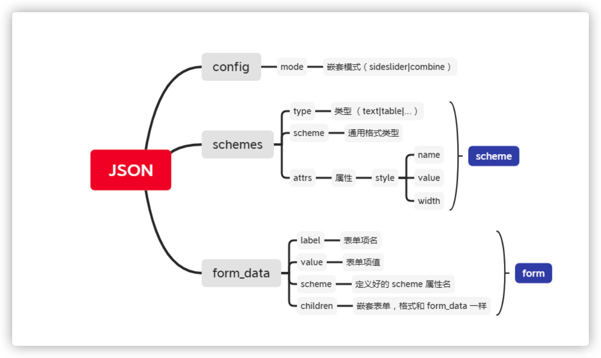
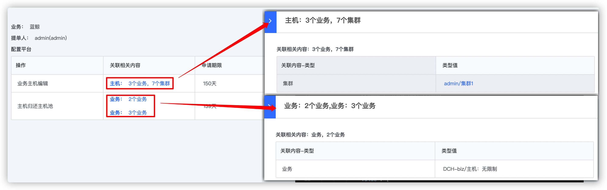

# 自定义表单渲染规则文档

>说明：自定义表单提供一个特殊的字段 `complicated_field`，用户按照一定的规则（具体见下免的使用指南）设计自己的表单展示和实现一些简单的层级交互

## 一、申请内容
自定义表单使用 JSON 文件进行渲染，JSON 中分为 `schemes`、`form_data`、`config` 三部分


### config
* `mode` 表单嵌套交互模式分两种 **sideslider（侧弹窗）** | **combine（面包屑嵌套）**，默认 **sideslider**

### schemes
* 由一个或多个 `scheme` 组成，它是一共通用格式类型，可以定义一组特殊属性的表单类型，在 `form` 中可以多处引用同一个 `scheme`; 这样就可以避免重复定义某种相同属性的类型表单项。
* 单个 `scheme` 属性说明：
    * `type`：表单类型，目前仅支持 **text**、**table**
    * `scheme`：引用定义好的 `scheme`，使用该属性会覆盖 `type` 属性
    * `attrs`：表单属性，具体属性请查看表单类型
    * `desc`：通用描述文字，会应用在每一个引用该 `scheme` 的表单上

### form_data
* 由一个或多个 `form` 组成，表单的渲染会遍历该数组
* 单个 `form` 属性说明：
    * `label`：表单项名
    * `scheme`：`schemes` 中已定义的 `scheme` 属性名
    * `value`：表单值
    * `desc`：表单描述，如果引用的 `scheme` 中有定义，会覆盖
    * `children`：嵌套表单

## 二、支持组件类型
* text
* table

### text
>表单的默认样式为 `name：value` 这样的键值对形式展示
* **attrs**
    * `style` 样式配置项
    * 注意：`attrs.style` 可单独配置 `name` 和 `value` 样式，内置支持 **highlight**，**border**
    
* **form_data**

    | 属性   | 类型   | 说明       | 默认值 | 是否必填 |
    | :----- | :----- | :--------- | :----- | :------- |
    | scheme | String | 对应scheme | 无     | 是       |
    | label  | String | 名称       | 无     | 否       |
    | value  | String | 表单值     | 无     | 是       |

    示例：
    ```json
    {
    //schema 配置
        "schemes": {
            // text scheme
            "base_text_scheme": {
                "type": "text",
                "attrs": {
                    "style": {
                        "label": ["border"],
                        "value": ["highlight", "border"] 
                    }
                }
            }
        },
    
    
        // form_data配置
        "form_data": [
            {// 单行文本
                "label": "业务",
                "scheme": "base_text_scheme",
                "value": "蓝鲸" 
            }, 
            {// 多行文本
                "label": "多行文本",
                "scheme": "base_text_scheme",
                "value": [
                    { "label": "业务1", "scheme": "base_text_scheme", "value": "蓝鲸" },
                    { "label": "业务2", "scheme": "base_text_scheme", "value": "其他" }
                ] 
            }
        ]
    }
  ```
    
### table

* **attrs.cloumn**

    `column` 表头信息，用户可根据自己的需求进行配置

    | 属性       | 类型   | 说明                 | 默认值                    | 是否必填 |
    | :--------- | :----- | :------------------- | :------------------------ | :------- |
    | name       | String | 表头名               | 无                        | 是       |
    | key        | String | 列唯一标识           | 无                        | 是       |
    | scheme     | String | 当前列的默认展示方式 | 则默认用table_text_schema | 否       |
    | attrs.sort | Array  | 排序                 | false                     | 否       |
    
* **form_data**:
    
    | 属性   | 类型   | 说明       | 默认值 | 是否必填 |
    | :----- | :----- | :--------- | :----- | :------- |
    | label  | String | 名称       | 无     | 否       |
    | value  | Array  | 表单值     | 无     | 是       |
    | scheme | String | 对应scheme | 无     | 是       |
    
* **value**:
    
    `form_data` 内 **value** 的配置格式为：列名为 **key**，当前 **key** 对应的值为当前单元格的显示内容
    
    单元格展示内容格式：
    
    | 属性  | 类型   | 说明   | 默认值 | 是否必填 |
    | :---- | :----- | :----- | :----- | :------- |
    | label | String | 名称   | 无     | 否       |
    | value | Array  | 表单值 | 无     | 是       |
    
    示例：
    ```json
    {
        "scheme": {
            "base_table_scheme": {     
                "type": "table",
                "attrs": {
                    "column": [
                        {
                            "name": "操作",
                            "type": "text",
                            "key": "column1"
                        },
                        {
                            "name": "关联相关内容",
                            "key": "column2",
                            "scheme": "table_text_scheme",
                            "attrs": {
                            }
                        },
                        {
                            "name": "申请期限",
                            "type": "text",
                            "key": "column3",
                            "attrs": {
                                "sort": true
                            }
                        }
                    ]
                }
            }
        },
    
    
        "form_data": [
            {
                "label": "配置平台",
                "scheme": "base_table_scheme",
                "value": [
                    {
                        "column1": { "value": "业务主机编辑" },
                        "column2": { "label": "主机:", "value": "3个业务，7个集群" },
                        "column3": { "value": "150天"  }
                   },
                    {
                        "column1": { "value": "业务主机编辑2" },
                        "column2": { "label": "主机:", "value": "4个业务，8个集群" },
                        "column3": { "value": "150天"  }
                   }
                ]
            }
        ]
    }

    ```

## 三、扩展

### 嵌套表单
>通过在使用表格 `form_data` 的列数据中，对某一列定义带有 `children` 属性，那么我们就认为该表单是一个嵌套类型的表单，点击则会打开下一级表单，层级以面包屑的方式展示

示例：
```json
{
    "form_data": [
        {
                "label": "配置平台",
                "scheme": "base_table_scheme",
                "value": [
                    {
                        "column1": { "value": "业务主机编辑" },
                        "column2": {
                            "label": "主机：",
                            "value": "3个业务，7个集群",
                            "children": [ // child1
                                {
                                    "label": "关联相关内容：3个业务，7个集群",
                                    "scheme": "sub_table_scheme",
                                    "value": [
                                        {
                                            "column1": { "value": "集群" },
                                            "column2": {
                                                "value": "admin/集群1",
                                                "children": [ // child2
                                                    {
                                                        "label": "配置平台",
                                                        "scheme": "sub2_table_scheme",
                                                        "value": [
                                                            {
                                                                "column1": { "value": "192.168.1.6" }
                                                            },
                                                            {
                                                                "column2": { "value": "192.168.1.6" }
                                                            }
                                                        ]
                                                    }
                                                ]
                                            }
                                        }
                                    ]
                                }
                            ]
                        },
                        "column3": { "value": "150天"  }
                    },
                    {
                        "column1": { "value": "主机归还主机池" },
                        "column2": { 
                            "value": [{ "label": "业务：", "value": "2个业务" },{ "label": "业务：", "value": "3个业务" }], // 单元格有多行 text 场景
                            "children": [ // 嵌套表单
                                {
                                    "label": "关联相关内容：业务，2个业务",
                                    "scheme": "sub_table_scheme",
                                    "value": [
                                        {
                                            "column1": { "value": "业务" },
                                            "column2": { "value": "DCH-biz/主机：无限制" }
                                        }
                                    ]
                                }
                            ]
                        }, 
                        "column3": { "value": "139天"  }
                    }
                ]
            }
    ]
}
```

### 表格中展示多行文本
>和普通单元格相比，区别在于 `value` 不是一个字符串，而是一个数组。
* `label` 如果不存在，`value` 值会占据整行空间。
* `label` 如果存在，`value` 会放在 `label` 右边。

示例：
```json
{
    // 单行
    "column1": { "value": "主机归还主机池" },
    // 多行
    "column2": { "value": [
    	{ "label": "业务：", "value": "2个业务" },
        { "label": "业务：", "value": "3个业务" }
    ] }
}
```

### 表单中添加描述
* 定义 desc 有两种方式，一个是在 scheme 中定义，一种是在 form 中定义
* 注意：form 中定义的 desc 会覆盖 scheme 中定义 desc
示例：
```json
{
//schema 配置
    "schemes": {
    	// text scheme
        "base_text_scheme": {
            "type": "text",
            "desc": "通用描述",
            "attrs": {
            }
        }
    },


    // form_data配置
    "form_data": [
        { // tips 为：通用描述
            "label": "业务1",
            "scheme": "base_text_scheme",
            "value": "蓝鲸1" 
        }, 
        {// tips 为：蓝鲸 2 描述
            "label": "业务2",
            "scheme": "base_text_scheme",
            "desc": "蓝鲸 2 描述",
            "value": "蓝鲸2"
        }
    ]
}
```

## 完整示例
表单如图所示：

配置如下：
```json
{
    "schemes": {
        "base_text_scheme": {
            "type": "text",
            "attrs": {
            }
        },
        "table_text_scheme": {
            "type": "text",
            "attrs": {
                "style": {
                    "label": ["border"],
                    "value": ["highlight", "border"] 
                }
            }
        },
        "base_table_scheme": {     
            "type": "table",
            "attrs": {
                "column": [
                    {
                        "name": "操作",
                        "type": "text",
                        "key": "column1"
                    },
                    {
                        "name": "关联相关内容",
                        "key": "column2",
                        "scheme": "table_text_scheme",
                        "attrs": {
                        }
                    },
                    {
                        "name": "申请期限",
                        "type": "text",
                        "key": "column3",
                        "attrs": {
                            "sort": true
                        }
                    }
                ]
            }
        },
        "sub_table_scheme": {
            "type": "table",
            "attrs": {
                "column": [
                    {
                        "name": "关联内容-类型",
                        "key": "column1",
                        "scheme": "base_text_scheme"
                    },
                    {
                        "name": "类型值",
                        "key": "column2",
                        "scheme": "table_text_scheme"
                    }
                ]
            }
        },
        "sub2_table_scheme": {
            "type": "table",
            "attrs": {
                "column": [
                    {
                        "name": "主机",
                        "key": "column1",
                        "scheme": "base_text_scheme"
                    }
                ]
            }
        }
    },
    "form_data": [
        {
            "label": "业务：",
            "scheme": "base_text_scheme",
            "value": "蓝鲸"
        },
        {
            "label": "提单人：",
            "scheme": "base_text_scheme",
            "value": "admin(admin)"
        },
        {
            "label": "配置平台",
            "scheme": "base_table_scheme",
            "value": [
                {
                    "column1": { "value": "业务主机编辑" },
                    "column2": {
                        "label": "主机：",
                        "value": "3个业务，7个集群",
                        "children": [
                            {
                                "label": "关联相关内容：3个业务，7个集群",
                                "scheme": "sub_table_scheme",
                                "value": [
                                    {
                                        "column1": { "value": "集群" },
                                        "column2": {
                                            "value": "admin/集群1",
                                            "children": [
                                                {
                                                    "label": "配置平台",
                                                    "scheme": "sub2_table_scheme",
                                                    "value": [
                                                        {
                                                            "column1": { "value": "192.168.1.6" }
                                                        },
                                                        {
                                                            "column2": { "value": "192.168.1.6" }
                                                        }
                                                    ]
                                                }
                                            ]
                                        }
                                    }
                                ]
                            }
                        ]
                    },
                    "column3": { "value": "150天"  }
                },
                {
                    "column1": { "value": "主机归还主机池" },
                    "column2": { 
                        "value": [{ "label": "业务：", "value": "2个业务" },{ "label": "业务：", "value": "3个业务" }], // 单元格有多行 text 场景
                        "children": [ // 嵌套表单
                            {
                                "label": "关联相关内容：业务，2个业务",
                                "scheme": "sub_table_scheme",
                                "value": [
                                    {
                                        "column1": { "value": "业务" },
                                        "column2": { "value": "DCH-biz/主机：无限制" }
                                    }
                                ]
                            }
                        ]
                    }, 
                    "column3": { "value": "139天"  }
                }
            ]
        }
    ]
}
```
