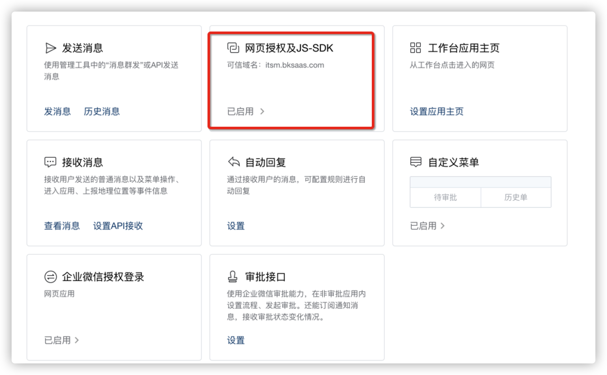
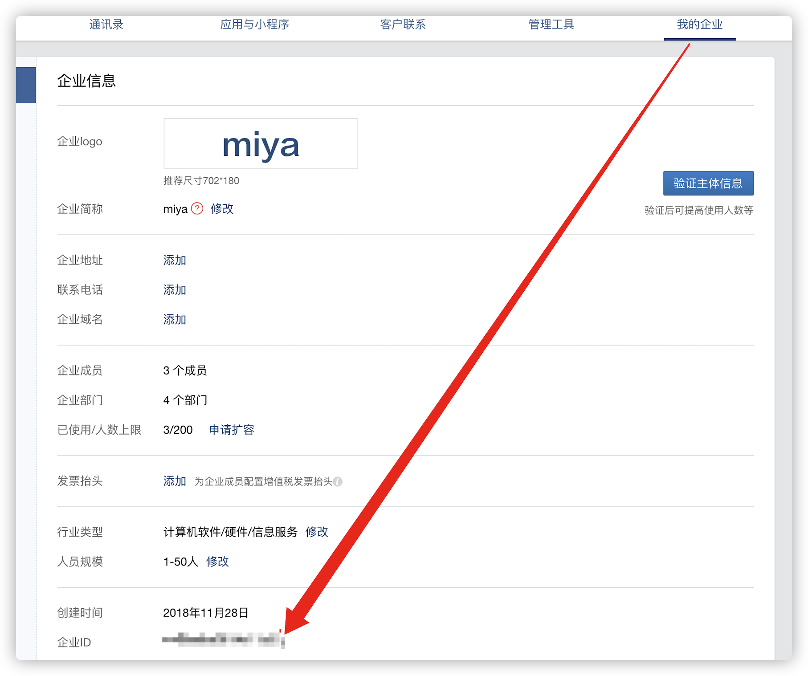
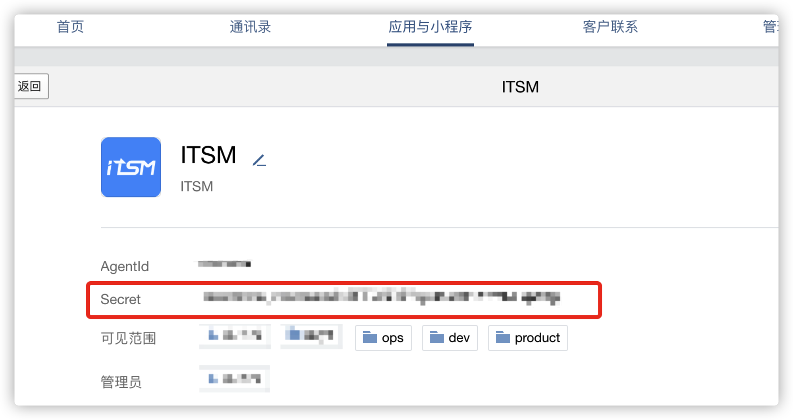
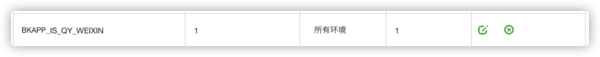
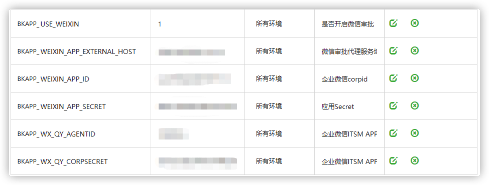
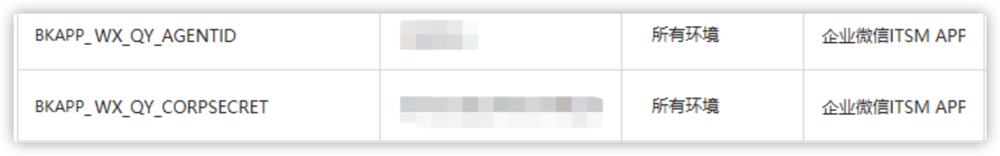
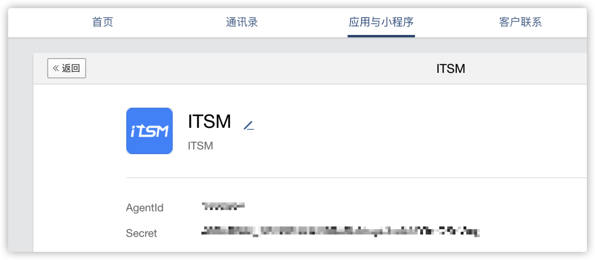
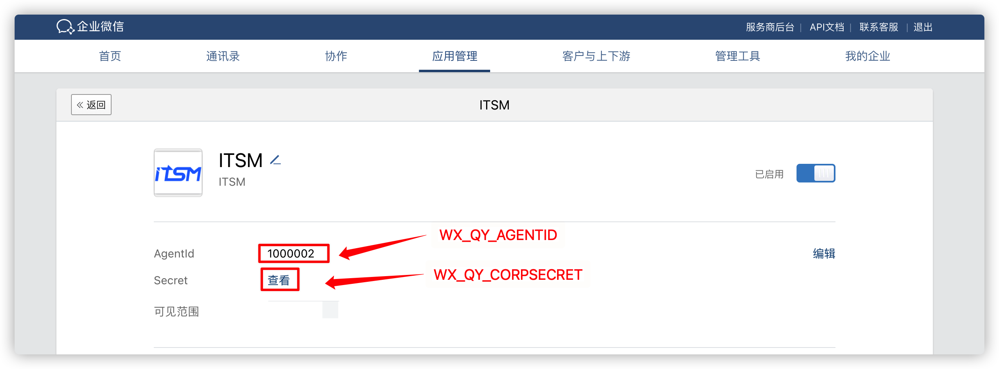
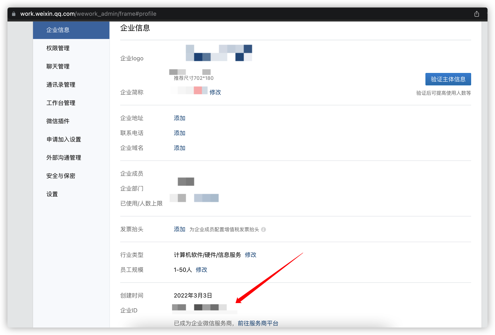
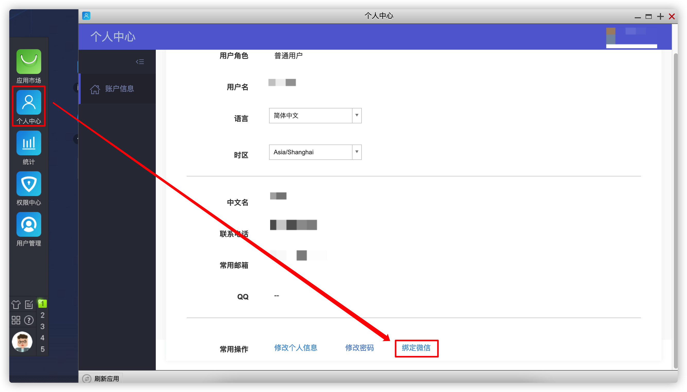

# ITSM外部移动端接入指引

### 一、接入前准备

* 登录企业微信服务商后台（https://open.work.weixin.qq.com/）

  确保您登录的账号为当前企业的**超级管理员**，否则无法登录

  

* 需要确保应用服务器（appo/appt）能访问到微信API和企业微信API （可以只设置企业微信API的代理）

  * 微信提供的API协议均为**https**
  * 域名1: `api.weixin.qq.com`
  * 域名2: `qyapi.weixin.qq.com`

### 二、接入步骤

#### （一）企业微信后台配置

1. 进入企业管理后台（https://open.work.weixin.qq.com/wwopen/developer#/index）

   

   进入应用管理

   

2. 创建应用

   

3. 设置企业微信应用的网页授权为**PAAS平台的外网域名**

   

4. 设置企业微信授权回调域，即**PAAS平台外网域名+端口号**，http为80，https为443

   

5. 设置应用主页为**ITSM的微信端访问链接**

   

#### （二）ITSM配置

1. 设置环境变量

   * `BKAPP_IS_QY_WEIXIN` : 1

   * `BKAPP_USE_WEIXIN` : 1

   * `BKAPP_WX_QY_AGENTID` : 企业微信应用AgentId

   * `BKAPP_WX_QY_CORPSECRET` : 企业微信应用Secret

     

   * `BKAPP_WEIXIN_APP_ID` : 企业ID

     

   * `BKAPP_WEIXIN_APP_SECRET` : 企业微信应用（任意）的Secret

   * `BKAPP_WEIXIN_APP_EXTERNAL_HOST` : **ITSM的首页访问链接**（例：https://paas.bktencent.com/o/bk_itsm/）

2. 在蓝鲸开发者中心重新发布应用

#### （三）绑定企业微信

1. 进入蓝鲸桌面，打开个人中心，使用蓝鲸账号绑定企业微信

   绑定成功后，需要==访问一次ITSM==，之后在企业微信工作台进入该应用即可自动登录

   > 如果不绑定，仍然可以使用目标环境的蓝鲸账户进行登录

   

