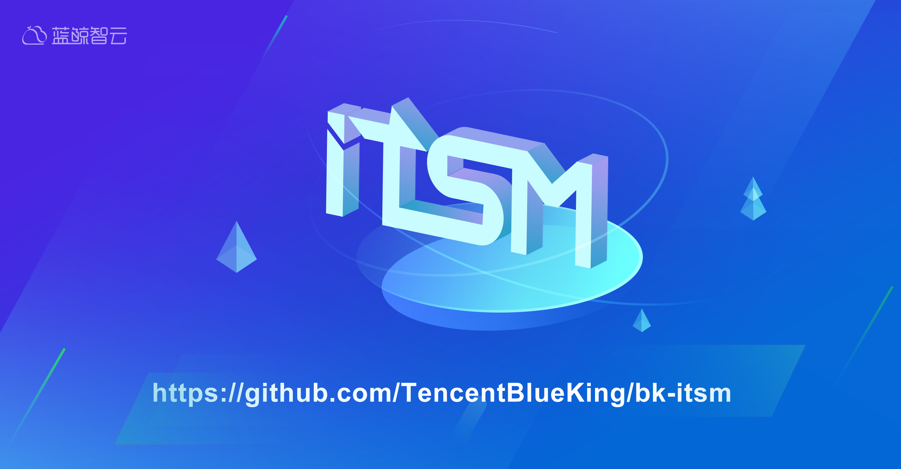
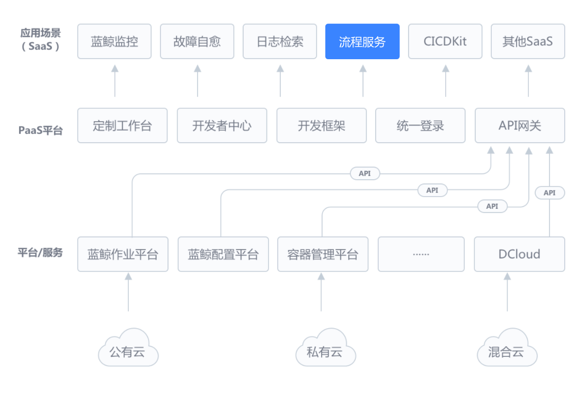
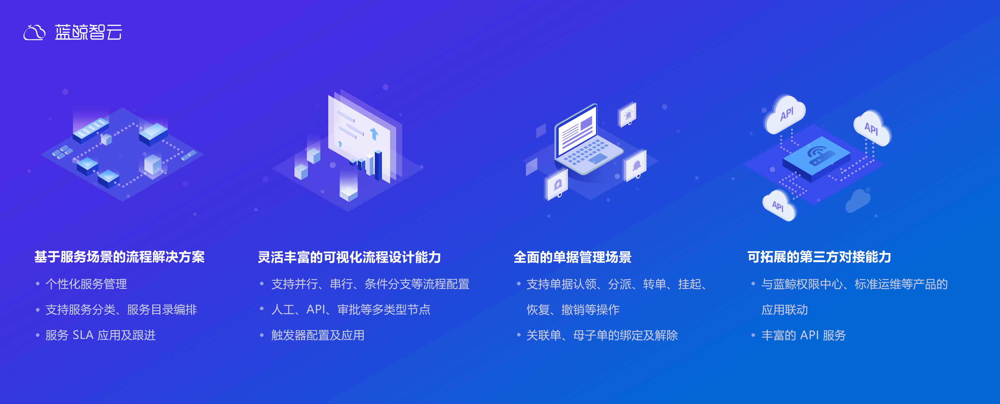
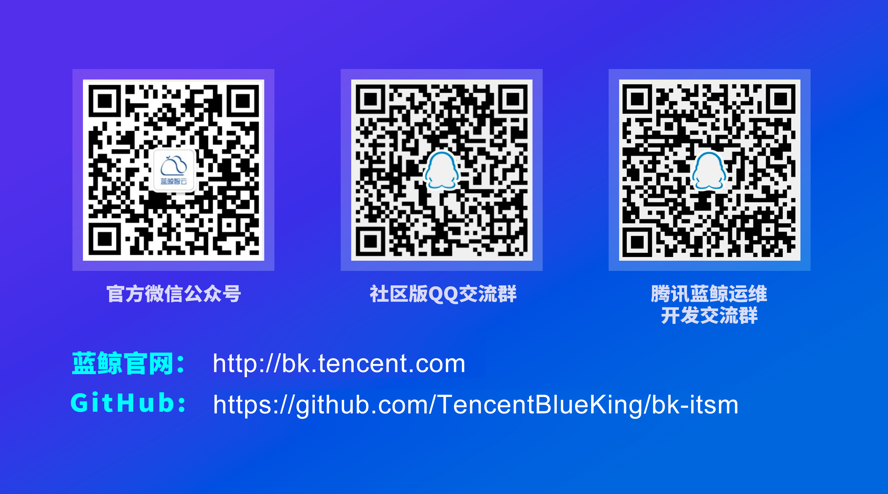
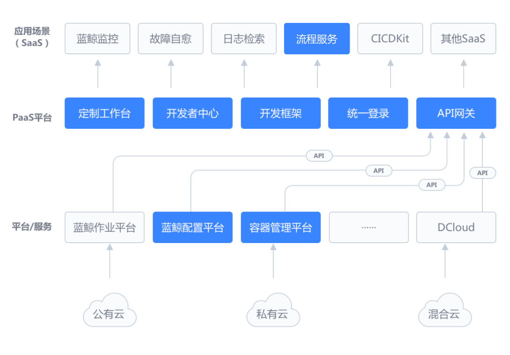

# 流程服务, 一套成熟的企业流程系统！

## 导读
>流程服务（ITSM），是基于蓝鲸智云体系的上层SaaS应用。通过可自定义设计的流程模块，覆盖IT服务中的不同管理活动或应用场景。帮助企业用户规范内部管理流程，提升沟通及管理效率。
蓝鲸智云流程服务(ITSM)，基于蓝鲸智云整体体系架构设计及开发。为用户提供可视化的流程配置服务，以满足用户的服务管理需求。同时，提供第三方对接能力，供用户可以调度蓝鲸体系中其它平台或服务能力的同时（配置平台，标准运维、ESB等），也能根据用户自身诉求实现与第三方服务的对接，降低沟通成本，提升流转效率。

## 功能特性

## 定位
腾讯蓝鲸智云根据自身的发展，将运维的发展历程分为四个阶段：
- 第一阶段：解放基础运维工作，开启WEB自动化时代
- 第二阶段：进入调度自动化时代，开放的API，连接一切
- 第三阶段：全方位的运营保障，用工具文化，引领运维新境界
- 第四阶段：探索运维价值，用数据驱动运营分析，实现智能决策，辅助运营

itsm 进入第三阶段，通过使用pipeline作为流程引擎，实现单据自由定义，状态流转，第三方系统接入，多种审批场景支持，为企业IT流程服务管理带来了新的可能性。

## 价值
“流程服务”，以流程设计及调用为其核心服务能力，专注为“有流程服务需求“的用户，提供合适的解决方案。
主要服务对象及服务内容：
1. 面向服务使用方：用户在服务台中消费/使用的服务入口，服务需求的提交及处理（如休假审批、资源申请、权限审批等等）；
2. 面向服务管理方：负责流程的设计和对应服务场景的应用配置管理；
3. 面向系统调用方：仅使用流程服务的第三方调度系统，对关联流程的配置和管理。

## 未来
我们希望通过开源，能够促进IT运维圈子同仁的凝聚力，共同构建一个友好、活跃的社区；相信大家的加入和共同陪伴一定可以使这个大生态社区变得更加强大、优秀。

## 关于开源协议
流程服务管理采用的是MIT开源协议。MIT是和BSD一样宽范的许可协议，作者只想保留版权，而无任何其他的限制。使用者必须在发行版里包含原许可协议的声明，无论是以二进制发布的还是以源代码发布的。

## 欢迎一起交流

## 腾讯蓝鲸智云
腾讯蓝鲸智云体系由平台级产品和通用 SaaS 服务组成，平台包括管控平台、配置平台、作业平台、PaaS 平台等，通用 SaaS 包括节点管理、标准运维、日志检索、蓝鲸监控、故障自愈等，为各种云（公有云、私有云、混合云）的用户提供不同场景、不同需求的一站式技术运营解决方案。

腾讯蓝鲸体系产品架构图-社区版  

说明：  
1、腾讯蓝鲸是一个体系化产品，需要各产品整体配合使用，才能发挥最大的功能价值；  
2、社区版中，目前开源的产品有：配置平台、PaaS平台、标准运维；  
3、配置平台、PaaS平台可以作为原子平台单独部署使用；  
4、流程服务必须跟整个体系配合使用。

开源产品链接  
流程服务：https://github.com/TencentBlueKing/bk-itsm
PaaS平台：https://github.com/Tencent/bk-PaaS  
配置平台：https://github.com/Tencent/bk-cmdb  
容器管理平台：https://github.com/Tencent/bk-bcs  
