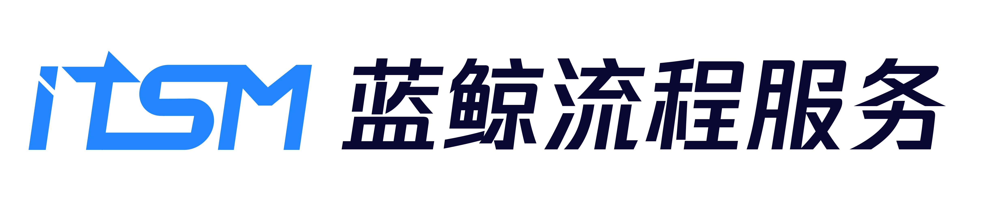

# ITSM

---

[(English Documents Available)](readme_en.md)

ITSM is the upper SaaS application based on Tencent Blueking product system. Cover different management activities or application scenarios in IT services through customizable process modules. Help enterprise users to standardize the internal management process, improve communication and management efficiency.

ITSM is designed and developed based on the overall architecture of Tencent Blueking product system. Provides visualized process configuration services for users to meet their service management requirements. At the same time, the third-party connection capability is provided so that users can dispatch other platforms or service capabilities in the Tencent Blueking product system (configuration platform, standard operation and maintenance, ESB, etc.), and the connection with third-party services can also be realized according to users' own demands, reducing communication costs and improving circulation efficiency.

The ITSM  uses Python as the development language and Django as the development framework. The front end uses Vue development page, through the front and back end separated development mode, while providing a beautiful and interactive interface, improve the overall development efficiency.

## Overview

- [Design Concept(In Chinese)](docs/overview/design.md)

- [Architecture Design (In Chinese)](docs/overview/architecture.md)

- [Code Directory (In Chinese)](docs/overview/code_structure.md)

## Feature
ITSM is a methodology to help enterprises effectively manage the planning, development, implementation and operation of IT systems. ITSM is a process-oriented approach to sorting out core processes from complex IT management activities, such as incident management, problem management and configuration management, and to standardize and standardize these processes, clearly defining the objectives and scope of each process, costs and benefits, operational steps, critical success factors and performance indicators, the responsibilities and rights of the personnel involved, and the relationships between the processes. We are committed to providing high-quality, low-cost and high-efficiency IT services to help enterprises improve their management efficiency.

ITSM is an upper layer SaaS application based on the Tencent Blueking product system. Through customizable process modules, it covers different management activities or application scenarios in IT services. It helps enterprise users standardize internal management processes and improve communication and management efficiency.

## Getting started  
- [Development Environment Deployment(In Chinese)](docs/install/dev_deploy.md)
- [Production Source Code Deployment (In Chinese)](docs/install/source_code_deploy.md)
- [Production Upload Deployment (In Chinese)](docs/install/upload_pack_deploy.md)
- [V2.6.0 -> V2.6.1 Upgrade Guide](docs/install/V2_6_0_to_V2_6_1_upgrade_guide.md)

## Usage
- [API Usage Instructions](docs/itsm_bkapi/apidocs/readme.md)
- [Permission Description](docs/install/permission_description.md)
- [Service & User Group Migrate Guide](docs/install/service_migrate_guide.md)
- [WeCom Configuration Instructions](docs/install/qy_weixin_config.md)
- [Custom Form Rendering Rules Instructions](docs/install/custom_form_config.md)
- [API_Request_Sandbox_Instructions](docs/install/api_sandbox_guide.md)
- [ITSM Access Guidelines](docs/wiki/access.md)

## Version plan
- [RELEASE](docs/RELEASE_EN.md)
[(Chinese Documents Available)](docs/RELEASE.md)

## Support
- [Source Code](https://github.com/TencentBlueKing/bk-itsm)
- [Wiki](https://github.com/TencentBlueKing/bk-itsm/wiki)
- [White paper(In Chinese)](https://bk.tencent.com/docs/document/6.0/145/6623)
- [BK forum](https://bk.tencent.com/s-mart/community)
- [BK DevOps online video tutorial(In Chinese)](https://cloud.tencent.com/developer/edu/major-100008)
- Contact us, technical exchange QQ group：878501914

## BlueKing Community

- [BK-CI](https://github.com/Tencent/bk-ci)：BlueKing Continuous Integration is a continuous integration and continuous delivery system that can easily present your R & D process to you.
- [BK-BCS](https://github.com/Tencent/bk-bcs): BlueKing Container Service is an orchestration platform for microservices based on container technology.
- [BK-BCS-SaaS](https://github.com/Tencent/bk-bcs-saas): SaaS of BlueKing Container Service is based on two modes, the native Kubernetes mode and the Mesos self-developed mode. It provides highly scalable, flexible and easy-to-use container management service for users.
- [BK-CMDB](https://github.com/Tencent/bk-cmdb): BlueKing Configuration Management DataBase (BlueKing CMDB) is an enterprise level configuration management platform for assets and applications.
- [BK-PaaS](https://github.com/Tencent/bk-PaaS): BlueKing PaaS is an open development platform that allows developers to create, develop, deploy and manage SaaS applications quickly and easily.
- [BK-SOPS](https://github.com/Tencent/bk-sops): BlueKing Standard OPS (SOPS) is a light-weighted SaaS product in the Tencent BlueKing product system designed for the orchestration and execution of tasks through a graphical interface.

## Contributing
If you have good ideas or suggestions, please let us know by Issues or Pull Requests and contribute to the Blue Whale Open Source Community. For Standard SOPS branch management, issues, and pr specifications, read the
[Contributing Guide](docs/CONTRIBUTING.md)。

If you are interested in contributing, check out the [CONTRIBUTING.md], also join our。[Tencent OpenSource Plan.](https://opensource.tencent.com/contribution) 

## FAQ
[FAQ](docs/wiki/faq.md)

## License
ITSM is based on the MIT protocol. Please refer to LICENSE for details. [LICENSE](LICENSE.txt) 。

